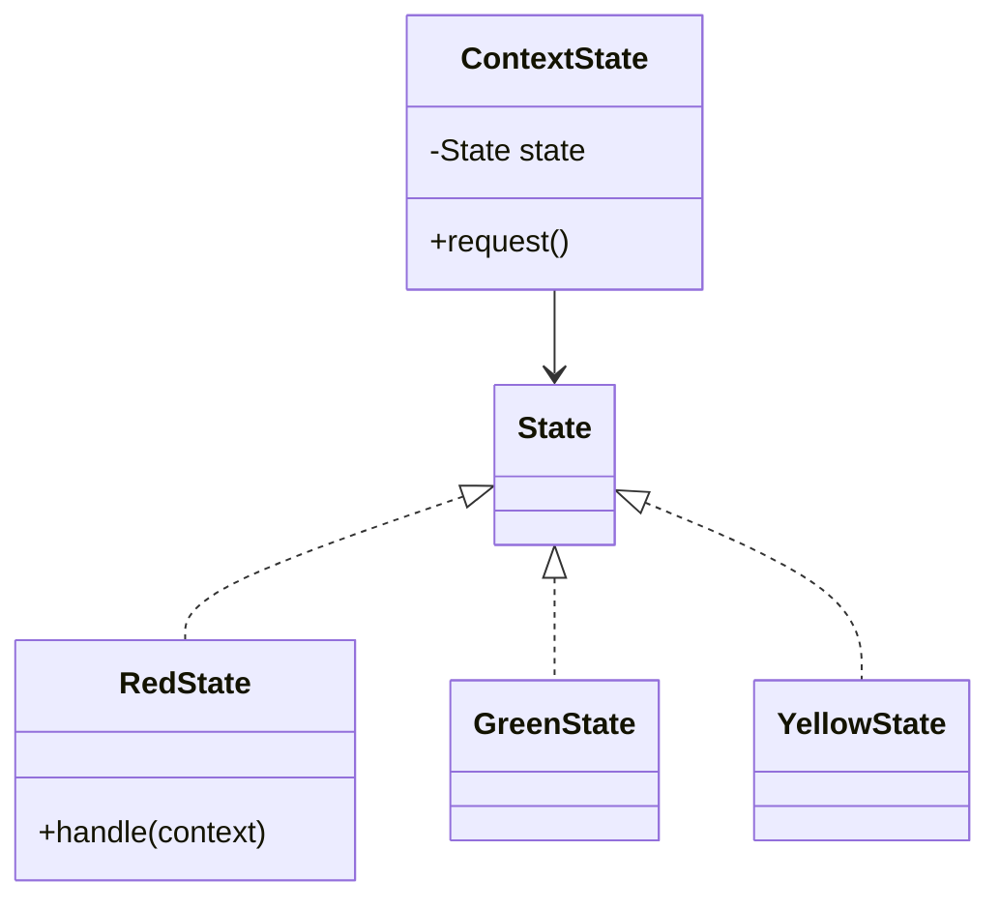

# TP State

```mermaid
classDiagram
    ContextState --> State
    State <|.. RedState
    State <|.. GreenState
    State <|.. YellowState
    ContextState : -State state
    ContextState : +request()
    RedState : +handle(context)
```